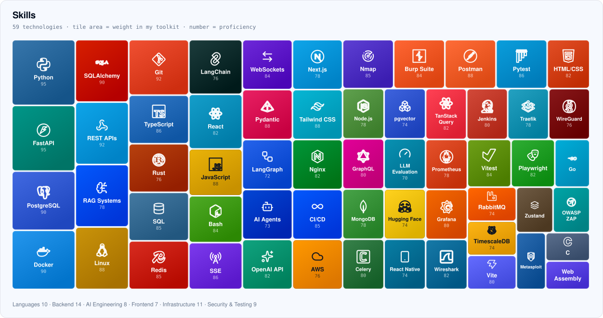

# Hi, I'm Bhadri 👋

**Software Engineer · Technical Lead · Salem, India**

I build systems people trust with untrusted input — and tools other developers install. Four years shipping production software end to end, from a police records CRM to cloud lab infrastructure, and now leading the build of an edtech platform.

- 🔭 **Technical Lead** at BloomSkillTech — building a two-sided edtech marketplace
- 🦀 Writing Rust where correctness has to be structural: sandboxes, filesystems, WireGuard
- 📦 Author of [**fastapi-querybuilder**](https://github.com/bhadri01/fastapi-querybuilder) — **16K+ downloads on PyPI**
- 🌐 [bha3.in](https://bha3.in) · [LinkedIn](https://www.linkedin.com/in/bhadri01)

---

## 🛠️ Skills

<!--
  Generated, not hand-written. `npx vite-node scripts/gen-profile-card.tsx` in
  the portfolio repo reads the same src/data/skills.ts the website renders and
  emits these two files, so this section cannot drift out of sync with bha3.in
  the way a hand-maintained badge list does. Regenerate after changing a skill.
-->

<picture>
  <source media="(prefers-color-scheme: dark)" srcset="./skills-dark.svg">
  <source media="(prefers-color-scheme: light)" srcset="./skills-light.svg">
  
</picture>

---

## 🚀 What I've built

**Systems & security**

- **[ZeroCode](https://github.com/bhadri01/ZeroCode)** — sandboxed code execution in Rust. Runs untrusted code across 20 languages behind 8 independent isolation layers (namespaces, `pivot_root`, cgroup v2, Landlock, seccomp BPF, full capability drop). 7-crate Axum workspace, Postgres `LISTEN/NOTIFY` as the job queue, live output over SSE. Hardened against 130+ adversarial tests — fork bombs, memory bombs, ptrace and mount escapes.
- **[ZeroVPN](https://github.com/bhadri01/ZeroVPN)** — self-hosted WireGuard management platform. Multi-crate Rust/Axum backend, React frontend, one `docker compose up`. Backend and frontend share a single wire schema by compiling a Rust crate to WASM and speaking MessagePack over WebSocket.
- **[NullVeil](https://github.com/bhadri01/NullVeil)** — read-only forensics tooling in Rust: filesystem parsers that physically cannot write to the disk they read.

**Open source**

- **[fastapi-querybuilder](https://github.com/bhadri01/fastapi-querybuilder)** — filtering, sorting and search for FastAPI + SQLAlchemy. JSON filters with 14 operators, nested relationship joins, global search, pagination and soft-delete — generated into SQLAlchemy, never string-built. **16K+ downloads**, 18 releases, MIT.
- **[fastapi_sse_events](https://github.com/bhadri01/fastapi_sse_events)** — server-sent events for FastAPI, backed by Redis pub/sub so streams survive more than one server.

**Platform & product**

- **AlgoTrade** *(private)* — automated trading for NSE/BSE on Zerodha Kite Connect. Rust risk-engine (position sizing, Black-Scholes Greeks, Sharpe/Sortino) called over stdin/stdout at µs latency; one broker WebSocket fanned out through Redis; 16-section React 19 dashboard; ticks in TimescaleDB.
- **Succeedex** *(private)* — multi-tenant edtech platform at [succeedex.in](https://succeedex.in). Role-based CRMs, an online test portal, and centralized OAuth across a Docker-based service suite.
- **Crime Records CRM** *(private)* — case management and timeline tracking, built single-handedly for the Cyber Crime Police Station, Salem. React + Go + PostgreSQL, deployed with Docker.

---

💬 Always up for a chat about building products from scratch — reach me on [LinkedIn](https://www.linkedin.com/in/bhadri01) or through [bha3.in](https://bha3.in).
